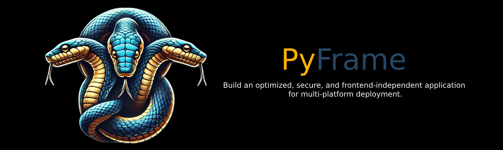
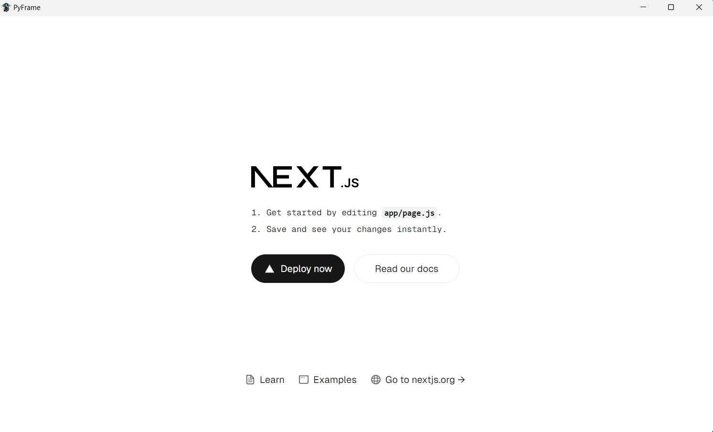
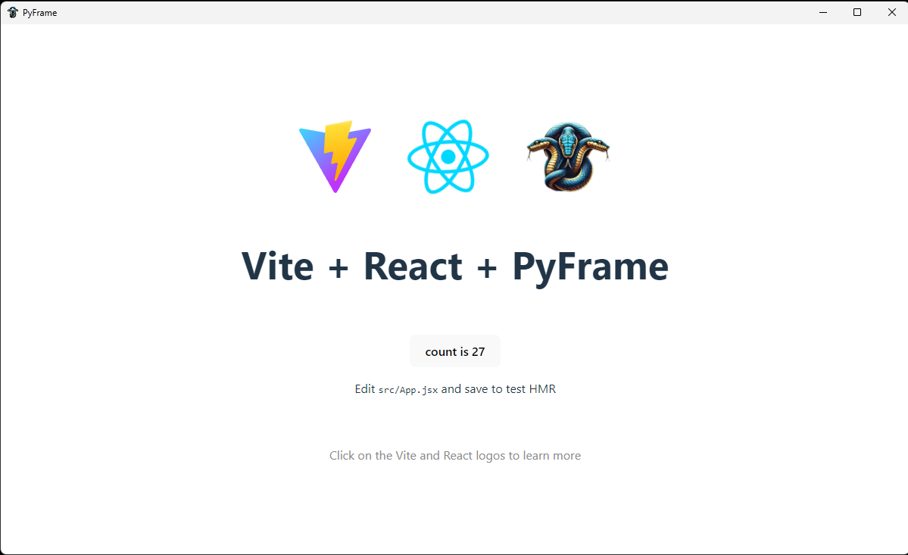

> 🚧 **Currently Under Development** 🚧 – We are actively building the core engine of PyFrame.

---

# 💡 PyFrame

**PyFrame** is a cutting-edge framework that generates highly efficient, compact binary files for major desktop platforms. It allows developers to integrate any front-end framework (HTML, JavaScript, CSS) with a Rust-powered Python backend, ensuring exceptional performance and reliability.

🚀 **Core Libraries:**  
- **[TAO](https://github.com/tauri-apps/tao)** – Cross-platform window management (macOS, Windows, Linux, Android, iOS). Support for Android and iOS will be added as soon as Python provides a stable API for these platforms.
- **[WRY](https://github.com/tauri-apps/wry)** – Native WebView rendering with unified API.

> 💡 We are currently developing an additional server that communicates with Rust via JavaScript. This is a temporary workaround due to some CPython API issues. Once resolved, this server will be removed, as PyFrame ultimately does not need an additional server! Instead, we use FastAPI as the primary runtime environment and leverage its built-in Socket.IO support for seamless communication between the Rust core and the frontend.

> 🪶 **Memory footprint:** PyFrame applications typically use 3–5 MB on macOS and Windows. On Linux, a few additional libraries may be needed (see installation below).

| Application Type           | Typical Memory Usage             |
|----------------------------|----------------------------------|
| Simple PyFrame Application | 3–5 MB                           |
| With HTML/CSS/JS Content   | 10–50 MB (depends on files used) |
| Complex Applications       | Still much smaller than Electron apps! |

> ⚠️ **Early Alpha Warning:** PyFrame is in early alpha and not production-ready. Explore the code, provide feedback, or contribute!

---

## ✨ Key Features

✅ **Ultra-Lightweight** – Fast and resource-efficient for all platforms.  
💻 **Cross-Platform** – Supports macOS, Windows, Linux, Android, and iOS.  
🦀 **Rust-Powered** – Safe and high-performance core.  
🔒 **Security-Focused** – Mitigates common web vulnerabilities.  
🔗 **Native Integrations** – Easily integrate custom features.  
⚡ **High Performance** – Minimal memory usage and small binaries.  
🔌 **Robust API** – Secure backend communication.  
⚙️ **Efficient Runtime** – Optimized for rapid startup and smooth operation.

---

## 📸 Screenshots

<div align="center">
  
  
</div>

---

### 🛠️ **Local Installation**
Follow these steps to set up **PyFrame** in your local development environment:


1️⃣ **Configure Git (if you haven't already):**  
```bash
git config --global user.name "Your Name"
git config --global user.email "your@email.com"
```

2️⃣ **Fork and clone the repository:**  
```bash
git clone https://github.com/YellowSiC/pyframe.git
cd pyframe
```

3️⃣ **Install the latest stable Rust version**  
👉 [Rust Install Guide](https://www.rust-lang.org/tools/install)
👉 Linux may require: 
```bash
sudo apt-get update && sudo apt-get install -y --no-install-recommends libayatana-appindicator3-dev libssl-dev libasound2-dev libwebkit2gtk-4.1-dev libgtk-3-dev pkg-config webkit2gtk-4.1
```


4️⃣ **Install [uv](https://github.com/astral-sh/uv)**  
👉 Follow the instructions in the [uv documentation](https://github.com/astral-sh/uv#installation).

5️⃣ **Initialize the environment and build the Rust extension:**  
```bash
python -m venv .venv
source .venv/bin/activate  # macOS / Linux
.venv\Scripts\Activate.ps1  # Windows PowerShell
.venv\Scripts\ctivate.bat  # Windows CMD
```

```bash
pip install maturin uv
```

```bash

make build-dev
```


✅ After these steps, **PyFrame** will be fully set up in your local environment and ready for development!  

🚀 Happy hacking!

6️⃣ **Run Examples:**  
```bash
python examples/basic.py
```

---

<div align="center">
  <h2>🤝 Contributing</h2>
  <p>We welcome contributions! Check out our <a href="CONTRIBUTING.md">contributing guidelines</a> for details on how to get involved.</p>
</div>

<div align="center">
  <h2>📜 License</h2>
  
  <p>Distributed under the Apache-2.0 and MIT licenses. See <code>LICENSE</code> for more information.</p>
</div>

---

### 💬 Stay Connected

<div align="center">
  Stay up to date by following us on social media or joining our community. We’re excited to bring PyFrame to a wider audience and welcome all feedback!
</div>

---

**👉 [Join our Discord community!](https://discord.gg/vmuQev5B)**
